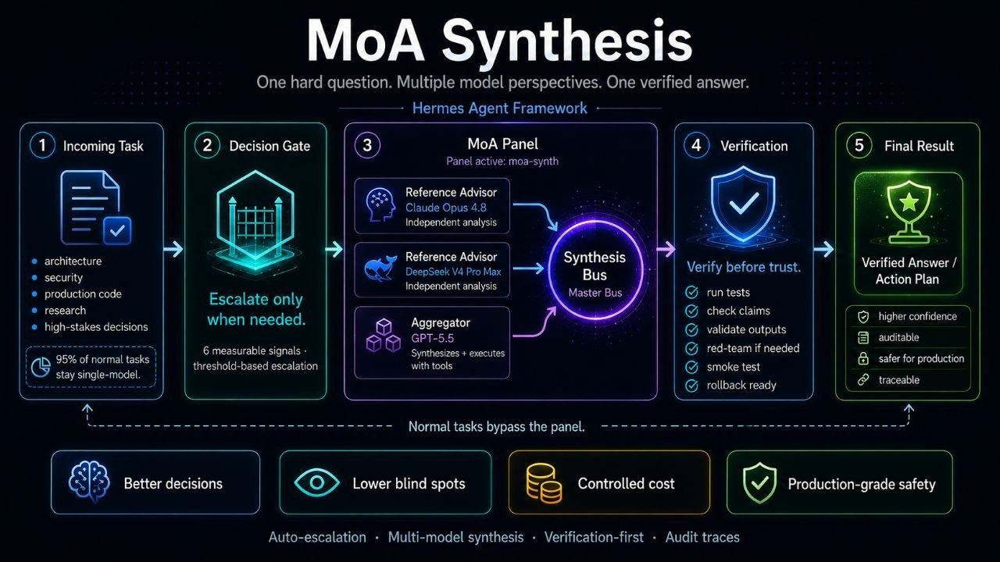

# MoA Synthesis

**One hard question. Multiple model perspectives. One verified answer.**

MoA Synthesis is a Hermes Agent skill for high-stakes decision escalation. Normal tasks stay fast and single-model; risky architecture, security, production, deployment, and research decisions can be routed through a structured multi-model advisor panel, synthesized by an aggregator, and verified before final output.

This is not a generic "ask multiple AIs" wrapper. It is an escalation discipline for tool-using agents.



## Why this exists

Autonomous agents are becoming more capable, but capability alone is not enough.

The more an agent can touch — code, servers, credentials, deployment flows, architecture, production systems — the more important it becomes for the agent to know when **not** to trust its first answer.

MoA Synthesis gives Hermes Agent a decision discipline:

- use one model when the task is simple;
- escalate when the decision is difficult, risky, disputed, or expensive to reverse;
- ask independent advisors for analysis;
- let one aggregator synthesize the answer and execute with tools;
- verify the result before treating it as done.

The goal is not to make the agent louder. The goal is to make the agent more careful when careful matters.

## Core concept

MoA Synthesis uses a Mixture-of-Agents style workflow:

1. **Incoming task** — the agent receives a task from the user or system.
2. **Decision gate** — the agent checks whether the task deserves escalation. Normal tasks bypass the panel.
3. **Reference advisors** — multiple strong models provide independent analysis. They do not execute tools. Their role is to reason, critique, compare approaches, and surface blind spots.
4. **Aggregator** — the execution model reads advisor outputs, reconciles disagreements, chooses a path, and performs the actual work.
5. **Verification** — the result is tested, checked, rendered, smoke-tested, or red-teamed depending on the task.
6. **Final answer / action plan** — the agent returns a verified answer, implementation plan, or production-aware recommendation.

## What makes it different

MoA Synthesis is designed as an agent skill with operational safeguards:

- automatic escalation based on task risk;
- threshold-based gating so the panel is not overused;
- advisor / aggregator separation so only the aggregator can act;
- briefing contracts so advisors receive structured context;
- verification-first workflow so model output is treated as a draft, not truth;
- audit traces so escalations can be inspected later;
- rollback awareness for production-sensitive changes;
- cost control by keeping normal tasks single-model.

## Escalation gate

MoA Synthesis should be considered when multiple risk signals are present, or when one signal represents an irreversible or high-impact decision.

Escalation signals include:

- the decision is hard to reverse;
- multiple valid approaches exist;
- the task touches production infrastructure;
- the task involves security, authentication, deployment, credentials, or data integrity;
- the answer depends on disputed research or uncertain trade-offs;
- a wrong answer could cause financial, technical, or operational damage;
- the agent is not confident that a solo answer would survive expert review.

Routine work should remain single-model. Examples: rewriting small text, renaming variables, summarizing short documents, generating boilerplate, running straightforward commands, or answering low-risk questions.

## Escalation levels

| Level | Shape | Use case |
|---|---|---|
| **L1 — Panel once** | One delegated panel with a judgment-shaped brief | One difficult question that benefits from independent reasoning |
| **L2 — Framed batch** | Multiple framed panels such as steelman A, steelman B, and risk audit | Forked decisions with several defensible approaches |
| **L3 — Adversarial round** | A second panel red-teams the surviving draft | Output will be shipped, graded, or trusted in a high-impact setting |

The best version of MoA is not the largest panel. It is the smallest reliable panel that materially improves the decision.

## Safety model

Advisor models are used for independent reasoning only. They should not receive secrets, raw credentials, private environment files, or unnecessary sensitive context.

The aggregator remains responsible for:

- final synthesis;
- tool execution;
- validation;
- user-facing output;
- rollback planning;
- audit reporting.

This keeps responsibility centralized while still benefiting from multiple independent perspectives.

## Verification model

MoA Synthesis treats model output as a strong draft, not a final fact.

Depending on the task, verification may include:

- running tests;
- checking logs;
- validating configuration;
- rendering UI output;
- performing smoke tests;
- comparing claims against source material;
- red-teaming the result;
- producing a rollback path before making changes.

For production-sensitive work, verification is not optional.

## Self-tuning panel

Version 3 adds a self-tuning workflow for the MoA panel itself.

When stronger models become available, the agent can:

1. discover configured providers without printing secrets;
2. rank candidate models by quality rather than novelty;
3. probe new candidates with a minimal live test;
4. update the active preset while preserving a rollback backup;
5. verify the resolved panel and smoke-test the new configuration.

This turns the skill from a static escalation policy into a maintainable operating layer.

## Verified runtime example

One verified deployment used the following panel shape:

| Role | Provider | Model |
|---|---|---|
| Reference advisor | OpenRouter | `anthropic/claude-opus-4.8` |
| Reference advisor | 9Router | `ds/deepseek-v4-pro-max` |
| Aggregator | OpenAI Codex | `gpt-5.5` |

This table is an example runtime configuration, not a requirement. The skill is about the escalation discipline: gate, brief, advise, aggregate, verify, trace, and rollback.

## Repository contents

```text
.
├── README.md
├── SKILL.md
├── assets/
│   └── moa-synthesis-flow.jpg
├── references/
│   └── playbook.md
├── examples/
│   └── sanitized-escalation-example.md
├── SECURITY.md
└── LICENSE
```

## Status

MoA Synthesis is an experimental Hermes Agent skill for structured multi-model escalation and verification-first agent workflows.

It is intended for builders working on autonomous agents, production AI systems, model routing, tool-using agents, agent safety, and high-stakes AI decision workflows.

## Short summary

MoA Synthesis gives Hermes Agent a way to pause before risky decisions, consult multiple independent model perspectives, synthesize the strongest path forward, and verify the result before acting.

It is a skill for one specific moment:

> when a single answer is not enough, and being wrong would be expensive.
